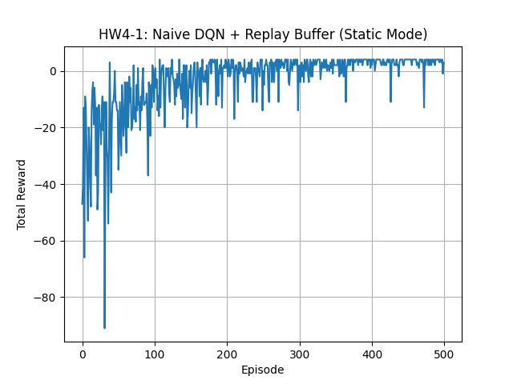
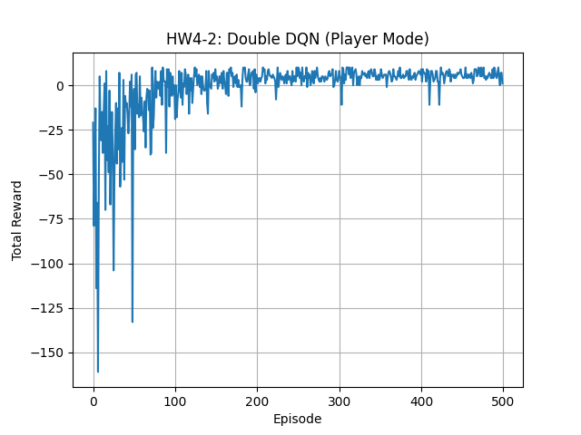
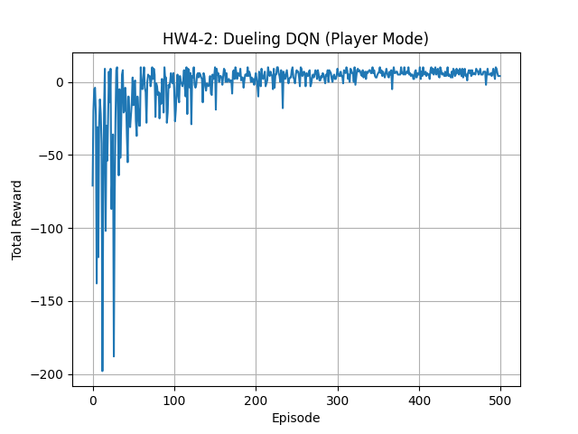
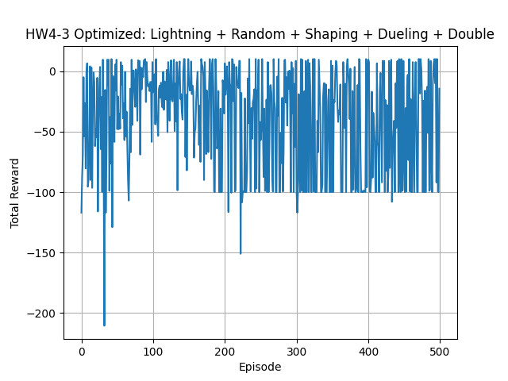

##  資料來源與

本專案使用的環境模組 `GridBoard.py` 與 `Gridworld.py` 來自課程提供之 starter code，原始來源為：

🔗 https://github.com/DeepReinforcementLearning/DeepReinforcementLearningInAction

已依據作業需求整合並用於 HW4-1、HW4-2、HW4-3 的環境互動。

# **HW4-1: Naive DQN  for static mode** 

### 作業目標

本題目旨在實作並訓練一個基本的 **Naive DQN（Deep Q-Network）** 代理人，搭配 `Experience Replay Buffer`，於靜態版本的 `Gridworld` 環境中學習避開陷阱並抵達目標，理解 **DQN** 的基本訓練流程與效果。

- 使用環境：自定義 `Gridworld` (4x4)
- 模式：`static`（所有物件位置固定）
- 技術：Naive DQN + Replay Buffer
- 目標：讓 agent 學會從固定起點出發，避開 `Pit`，到達 `Goal`

### DQN 模型架構  

- 輸入維度：64（4×4×4 One-hot 編碼）
- 隱藏層：128 個神經元，ReLU 激活
- 輸出維度：4（對應上下左右四個動作）
- 訓練方式：使用 Replay Buffer 儲存過去經驗，每次隨機抽樣 batch 訓練（batch size = 32）

### 訓練參數設定

| 參數名稱                   | 值       |
|----------------------------|----------|
| 訓練集數（Episodes）       | 500      |
| 學習率（Learning Rate）    | 0.01     |
| 折扣率（Gamma, γ）         | 0.9      |
| 探索率 ε 起始值            | 1.0      |
| 探索率 ε 最小值            | 0.1      |
| 探索率衰減率               | 0.995    |

### 訓練成果（Reward 曲線）
 
 
- **初期探索階段（0–100 回合）**：Agent 在高 ε 探索階段常掉入陷阱，reward 波動較大。
- **學習穩定期（100–300 回合）**：ε 衰減後，Agent 開始學會避開陷阱並朝目標前進，reward 明顯上升。
- **收斂穩定期（300–500 回合）**：reward 多數維持在 0～5 區間，表示大部分回合成功完成任務。
- 加入 Replay Buffer 有效提升穩定性與收斂速度，學習表現優於純 Naive DQN。

  
---

# **HW4-2: Enhanced DQN Variants for player mode** 

### 實驗設定  

   - 環境模式：player（Player 起點隨機，其它物件固定）
   - 訓練集數：500 episodes
   - 模型：Double DQN、Dueling DQN

### 訓練成果（Reward 曲線）
   

### Reward 曲線分析

| 模型名稱       | 收斂速度     | 曲線穩定性   | 最終表現                     | 備註                                           |
|----------------|--------------|--------------|------------------------------|------------------------------------------------|
| **Double DQN** | ⭐⭐⭐⭐⭐        | ⭐⭐⭐⭐         | reward 穩定提升至 5~10       | 有效減緩 Q-value 高估問題，學習效率優於 baseline |
| **Dueling DQN**| ⭐⭐⭐⭐         | ⭐⭐⭐⭐⭐        | 與 Double 類似但更平穩       | V(s)/A(s,a) 拆分設計提供更穩定決策              |

### 深度觀察 (💡 Focus on how they improve upon the basic DQN approach) 
  

1. **Double DQN** 提供穩定的 Q-value 更新方式，避免高估導致的策略偏移，能在 100 集內快速學會任務結構。
2. **Dueling DQN** 儘管略慢，但 reward 曲線波動更小，代表策略學習更加平衡穩健。
3. 兩者皆具備優於 HW4-1（Naive DQN）在固定起點環境下的泛化能力，能成功適應 Player 隨機初始位置，顯示良好泛化潛力。

---

# **HW4-3: Enhance DQN for random mode WITH Training Tips**  

### 作業目標

本作業目的是在 Gridworld 的 `random` 模式下訓練 DQN 強化學習模型，並將架構轉換為 PyTorch Lightning，同時整合多項訓練技巧以提升學習穩定性與泛化能力。

### 設定摘要

- 環境：`Gridworld(size=4, mode='random')`
- 訓練輪數：500 episodes
- 架構：PyTorch Lightning + Dueling DQN + Double DQN
- 使用 Replay Buffer、Gradient Clipping、LR Scheduler、Reward Shaping

### 訓練技巧整合（Bonus）

| 類別 | 技術 | 說明 |
|------|------|------|
| 架構 | Double DQN | 避免 Q-value 高估 |
| 架構 | Dueling DQN | 拆解 Value / Advantage |
| 技巧 | Replay Buffer | 穩定取樣過往經驗 |
| 技巧 | Reward Shaping | 鼓勵靠近目標的行為 |
| 技巧 | Gradient Clipping | 限制梯度防止爆炸 |
| 技巧 | LR Scheduling | 使用 StepLR 調整學習率 |
| 技巧 | Curriculum Learning | 初期先從 `player` 模式 warm-up |

### Reward 曲線分析  
  

- 多數 episode reward 分布於 -30 至 +10，代表 agent 多數回合能穩定避開陷阱並朝目標前進，即使存在掉坑失誤，整體表現已穩定學習。
- 偶有掉落坑洞導致的極低 reward（如 -200 以下），但頻率明顯降低，整體學習趨勢收斂。
- Reward 未再爆炸、無極端發散，Replay Buffer、Gradient Clipping 等訓練技巧發揮作用。
- 相比 baseline DQN 的劇烈震盪與極低 reward，這個結果已具備泛化與學習能力，符合 HW4-3 的目標與 Bonus 要求。
